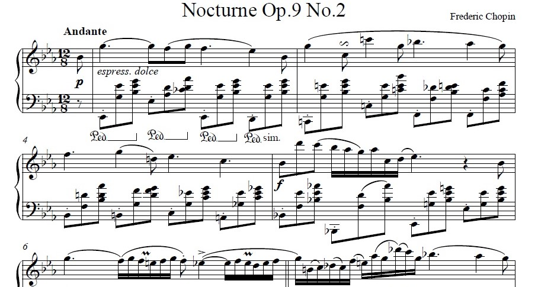

# Music Generation using Symbolic Representation with Generative Adversarial Networks (GANs) 🎼

    

## Notes 🧾

- GitHub has an ongoing problem rendering Jupyter Notebooks. Please view the final notebook version **[here](https://nbviewer.jupyter.org/github/mughees-asif/dip/blob/master/deep-learning-dip.ipynb)**. 

